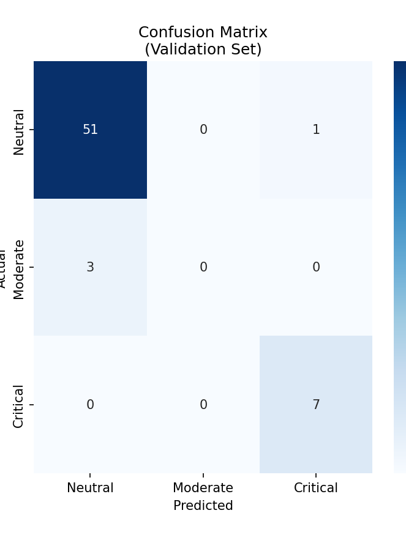

# Drug-Food Interaction Risk Assessment - Evaluation Report

## 1. Training Architecture
- **Task**: Multiclass Classification (0: Neutral, 1: Moderate, 2: Critical)
- **Training Sample Size**: 248 pairs
- **Validation Sample Size**: 62 pairs
- **Unseen Held-Out Size**: 80 pairs

## 2. Model Metrics by Split

### 🟢 Training Set Metrics
- **Accuracy**: 0.9476
- **Precision (Weighted)**: 0.9459
- **Recall (Weighted)**: 0.9476
- **F1 Score**: 0.9467

### 🟡 LODCO Validation Set Metrics
- **Accuracy**: 0.9355
- **Precision (Weighted)**: 0.8909
- **Recall (Weighted)**: 0.9355
- **F1 Score**: 0.9124

### 🔴 Unseen Test Set Metrics
- **Accuracy**: 0.8375
- **Precision (Weighted)**: 0.7793
- **Recall (Weighted)**: 0.8375
- **F1 Score**: 0.7916

## 3. Visual Dashboards

### Confusion Matrix (Validation)

### Accuracy Comparison

### ROC Curves

### Feature Importance

