# Drug-Food Interaction Risk Assessment — Full Evaluation Report

## 1. Training Architecture
- **Model**: Soft-Voting Ensemble (XGBoost + RandomForest + GradientBoosting)
- **Task**: Multiclass Classification (0: Neutral, 1: Moderate, 2: Critical)
- **Preprocessing**: BorderlineSMOTE | RFE(20) | StandardScaler | Morgan FP (256-bit)
- **Split Strategy**: Leave-One-Drug-Out (LODO) for unseen evaluation
- **Training Sample Size**: 283 pairs
- **Validation Sample Size**: 71 pairs
- **Unseen Held-Out Size (LODO)**: 84 pairs

## 2. Classification Metrics by Split

### 🟢 Training Set
| Metric | Value |
|--------|-------|
| Accuracy | 0.8834 |
| Precision | 0.8817 |
| Recall | 0.8834 |
| F1 | 0.8812 |
| Roc_Auc | 0.9799 |

### 🟡 Validation Set
| Metric | Value |
|--------|-------|
| Accuracy | 0.8028 |
| Precision | 0.7977 |
| Recall | 0.8028 |
| F1 | 0.7974 |
| Roc_Auc | 0.8899 |

### 🔴 Unseen Test Set (LODO)
| Metric | Value |
|--------|-------|
| Accuracy | 0.8690 |
| Precision | 0.8670 |
| Recall | 0.8690 |
| F1 | 0.8667 |
| Roc_Auc | 0.9513 |

## 3. Regression Metrics (% Bioavailability Change)

| Split | RMSE | MAE | R² |
|-------|------|-----|-----|
| Train | 6.2604 | 4.0180 | 0.9552 |
| Validation | 22.4861 | 17.3290 | 0.4091 |
| Unseen (LODO) | 20.5662 | 15.9350 | 0.4416 |

## 4. Visual Dashboards

### Evaluation Dashboard (Combined)
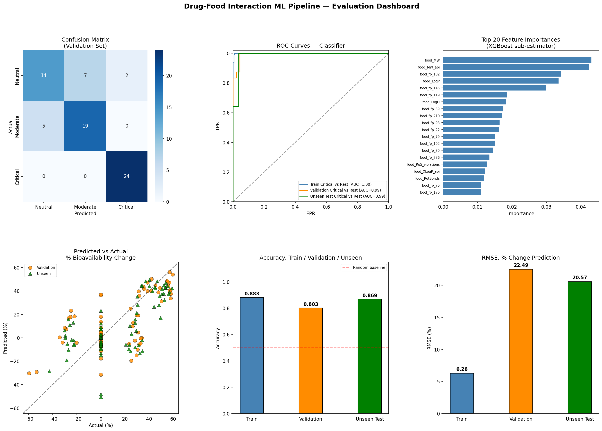

### Confusion Matrices (Validation vs Unseen)
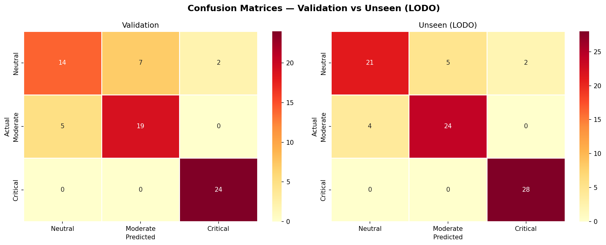

### Per-Class Metrics (Precision / Recall / F1)
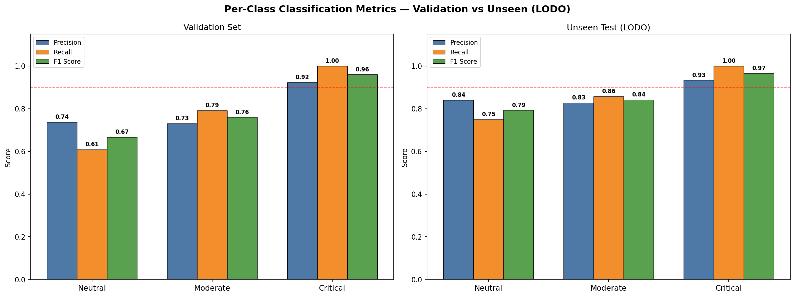

### ROC Curves (Critical vs Rest)
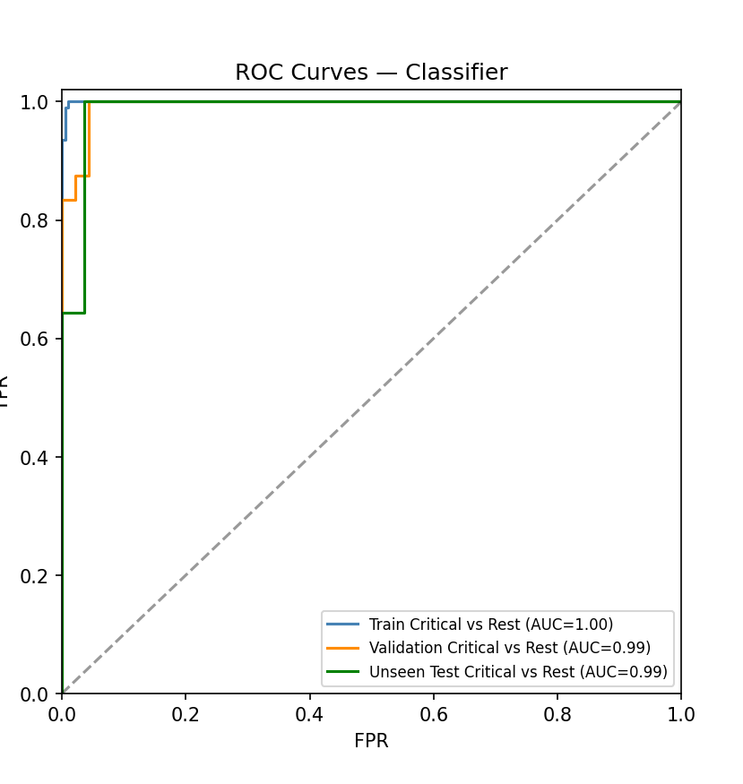

### Per-Class ROC Curves (One-vs-Rest)
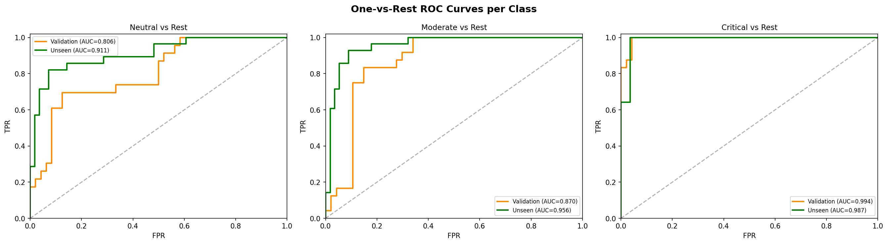

### Metrics Radar Chart
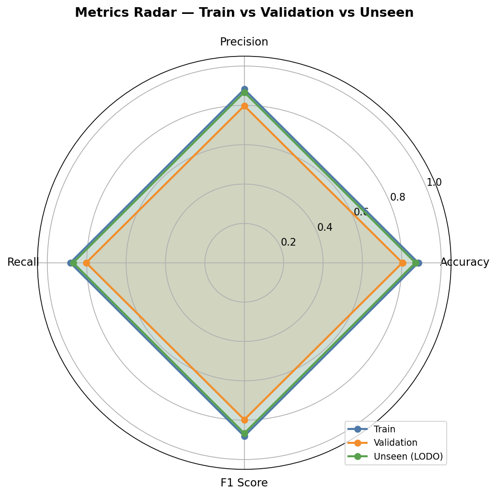

### Class Distribution (Actual vs Predicted)
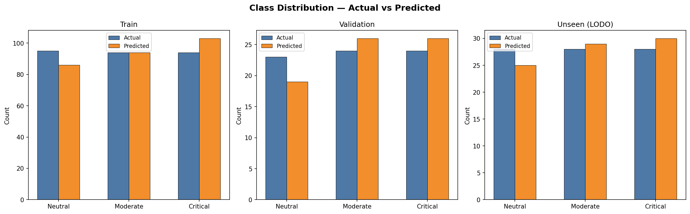

### Feature Importance (XGBoost sub-estimator)
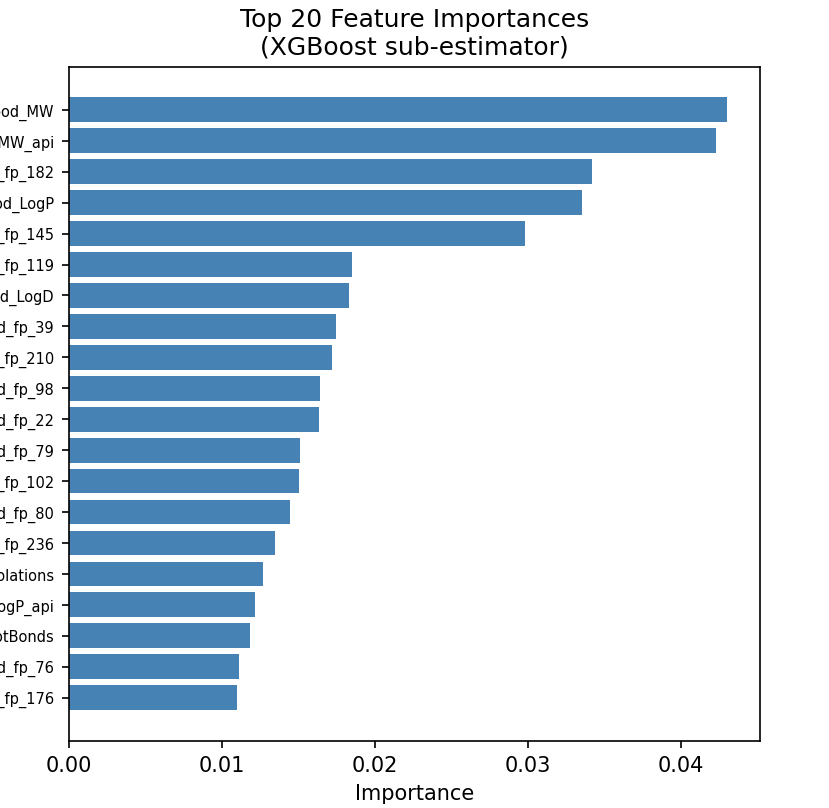

### Predicted vs Actual (Regression)
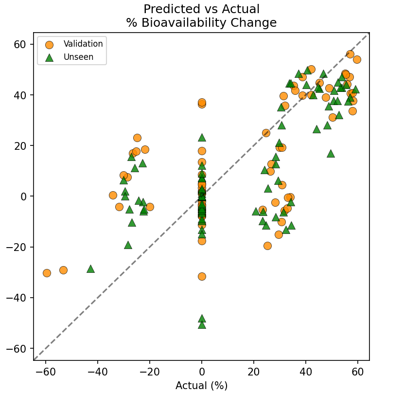

### Regression Residuals
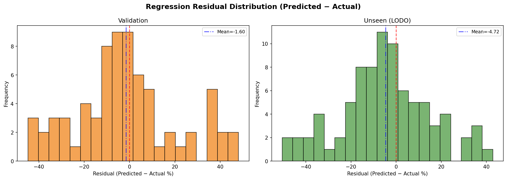

### Accuracy Comparison (Train/Val/Unseen)
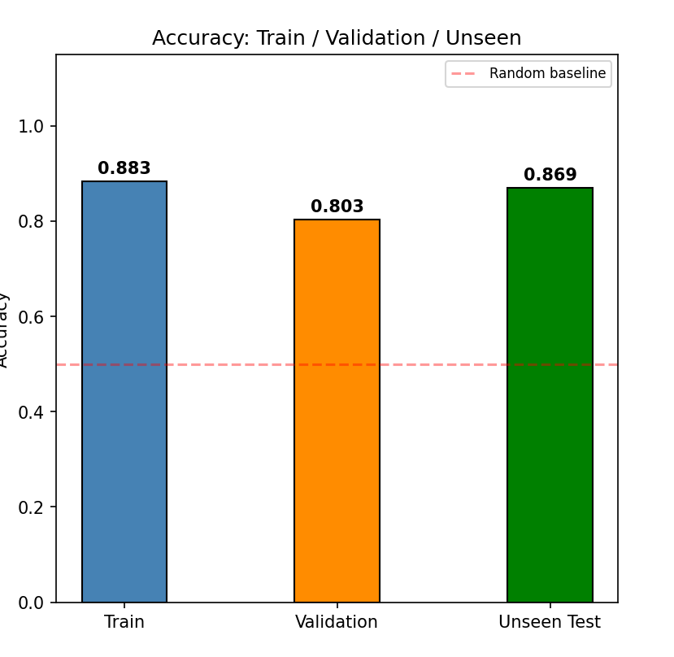

### SHAP Interpretability
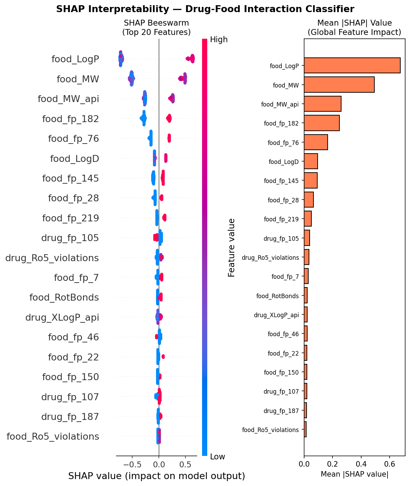

